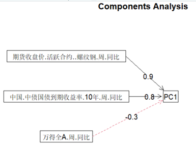
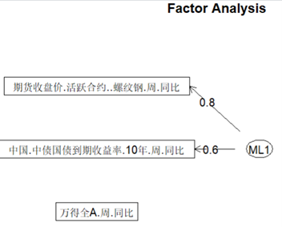
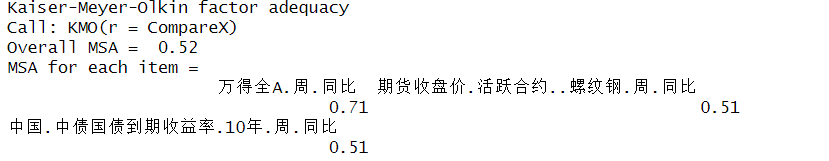
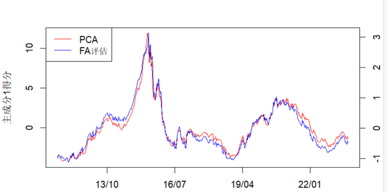

# Summary of Principal Component Analysis(PCA) and Factor Analysis(FA)
This article mainly summary the differences between principal component analysis and factor analysis, their advantage & disadvantage, and my personal vas examples.

## Differences
- Principal Component Analysis:
  - Can be selected based on their contribution rates to retain the maximun number nevessary, thereby it could summarize, compress, and reduce the dimensionlity of variables.
  - Represents the principal components as linear combinations of the initial variables.
  - Principal Component Analysis is merely a transformation of variables.
- Factor Analysis:
  - Factor Analysis is primarily used to identify which factors determine each variable. It uncovers the underlying causes of each variable, revealing how common factors influence them. Essentially, it serves as an expansion and interpretation of the variables.
  - Represent the original observed variables as a linear combination of new factors.
  - Factor analysis requires constructing a factor model.

## Advantage and Disadvantage
- Principal Component Analysis:
  - Advantage: By synthesizing and simplifying the original variables, the weights of each indicator can be objectively determined, avoiding the subjectivity and arbitariness of judgement.
  - Disadvantage: Suitable for data which is a strong correlation between variables. If the original data has weak correlations, it will not effectively serve the purpose of dimensionality reduction.
- Factor Analysis:
  - Advantage: It can help identify the correlation struction of vatiables, reveal the potential factor structure.
  - Disadvantage: Factor analysis requies a amount of data, it is influenced by the quality of the sample. If the sample is insufficient or had poor quality, the results are likely to be distorted.  
    Requires the pre-setting of the number of factors. It is often difficult to determine the exact number of factors. The size of the sample data affects the number of factos. Moreover, factor analysis is highly subjective, the quality of factor analysis is significantly.

## Reasons why factor analysis cannot be used
In rebar, WanD-A index and governement bond yields case, the sample size is samll. There are no common factors, the data is not representative. In Comparsion, PCA is more comprehensive.  
Figure 1.1 shows that each variable has a certain proportion in the pricipal components analysis whis us reoresentative.   
<br/>Figure 1.1: Precentage of each variable's contribution in PCA  
<br/>   Figure 1.2:Factor precentage in FA  


Before performing factor analysis, you can also check the KMO(Kaiser-Meyer-Olkin) measure to access the correlation between variables and determine whether factor analysis is appropriate.<br/>
```
install.packages("psych")  
library(psych)  
KMO(var)
```


Form the example of the Shanghai SStock Exchange, Shenzhen Stock Exchange, and ChiNext， it can be seen that when both PCA and FA are applicable, the factor scores derived from the factor analysis and the trend chart obtained from the principal components show a high degree of overlap. Therefore, both method can be used simultaneously for comparison.<br/>


