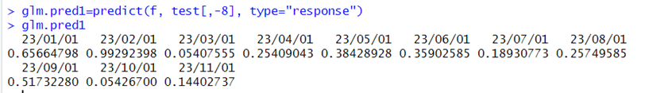

# Logistic Regressions and Multiple Linear Regression Model
To observe whether the trend of PMI decline or increase is influenced by industrial principal components, actual EPMI, and measured PMI trends, a model was built to analyze data over a period of 70 months from January 1 2018 to December 1 2023.

## Process
1. Calculate the trend of each variable and assign values: 1 for increase, -1 for decrease, and 0 for no change.
2. Compare with the PMI trend, use Excel to calculate accuracy.
3. Since EPMI has many sub-items, there will focuses on the impact rate of EMPI.

## Result
- Individually:<br/>
  1. The industrial principal component's accuracy is 51.7% over five years, 52.8% over the three years, 66.72% over one year, and 80% over the past ten months.<br/>
  2. The actual EPMI accuracy is 63.3% over five years, 72.2% over three years, 66.7% over one year, and 70% over the past ten months.<br/>
  3. The measured PMI accuracy is 56.7% over five years, 63.9% over three years, 58.3% over one year, and 60% over the past ten monnths.<br/>

- Overall:<br/>
  The probability of PMI and all three indicators rising simultaneously is 63.6%, while the probability of PMI and all three indicators declining simultaneously is 92.3%.<br/>

- For the Model Fitting:<br/>
  The Logistic Regression model achieves a prediction accuracy of 72.7%, while the multiple Linear Regression model has a higher accuracy of 90.9%. The multiple linear regression model primrily relies on EPMI production colume, EPMI imports and EPMIemployment as key factors.

- From the perspective of EPMI sub-items:<br/>
  The actual EPMI trend aligns with the cumulative direction of its sub-components, with EPMI production volume and EPMI product orders being the primary contributors, followed by imports and employment. Over the past two years, the proportion of product orders has gradually increased. The actual EPMI and PMI trends mostly correspond to production volume, while other sub-components influence the overall trend in proportion.
  
## Basic Data

#### Industrial Principal Component:


#### Actual EPMI:


#### Measured PMI:


The three indicators rose simultaneously 11 times, and PMI showed the same trend 7 times, with a probability of 63.6%; the three indicators declined simulatneously 13 times, and PMI showed the same downward trend 12 times, with a probability of 92.3%. During other times, PMI fluctuated up and down under the influence. 


## EPMI Sub-components:
Compare the Following five sets of indicators: EPMI and PMI production volume, EPMI product orders and PMI new orders, EPMI and PMI imports, EPMI procurement prives, EPMI ex-factory prices, and EPMI and PMI employment.
<br/>
From the charts, it can be obeserbed that the actual EPMI trend is similar to the trends of all the sub-components, and the PMI trend is also similar to that of all the sub-components. However, there may ne slight differences due to the relatively small number of indicatoers.
<br/>
Based on the observations, EPMI production volume and product orders have a significant impact on the actual EPMI, followed by employment or imports. Procurement prices have the least impact, or even none, and can be considered negligible.

<br/>

<br/>
The trend of EPMI procurement pricies shows a large difference from the actual EPMI trend, with an accuracy of only 48.6%. Additionally, data is missing for the past 8 months, so this indicator can be excluded. The focus should be on observing EPMI and PMI production volume and product orders.

## Multiple Linear Regression Model
| Model | Model 1 | Model 2 | Model 3| Model 4 | Testing Data|
| --- | --- | --- | --- | --- | --- |
| Time line | 2018-2022 | 2019-2022 | 2020-2022 | 2021-2022 | 2023|

- Model 1(2018-2022): According to PMI trend in 2023, the model 1 correct predictions 9 times, with a probability of 81.8%
  <br/>
- Model 2(2019-2022): According to PMI trend in 2023, the model 2 correct predictions 10 times, with a probability of 90.9%.
  <br/>
- The prediction accuracy of Model 3 is the same as Model 2, and the prediction accuracy of Model 4 is the same as Model 1.
- The regression coefficients of Model 2 represent the paramaters indicating the impact of variables on PMI:
  
By observing the regression coefficients, it can be seen that some variables have a minimal impact on PMI. However, including these variables increases the residuals will affect the accuracy of model. Therefore, the ```step()``` function is used to perform stepwise regression, eliminating variables with little impact and identifying the optimal regression equation.

#### Stepwise Regression:
Stepwise regression retains only the three variables with the highest contribution rates. Using these three variables and data from 2019 to 2022, a new model is constructed leading to the following results:<br/>
<br/>
**Correct predictions 10 times, with a probability of 90.9%.**
</br>
<br/>
The regreesion equation of the new model is:
$PMI = 0.184 EPMI Production Volume + 0.104 EPMI Imports - 0.169 EPMI  Employment- 0.00588$

<br/>
## Logistic Regreesion Model

| Model | Model 1 | Model 2 | Model 3| Model 4 | Testing Data|
| --- | --- | --- | --- | --- | --- |
| Time line | 2018-2022 | 2019-2022 | 2020-2022 | 2021-2022 | 2023|

Among the four models, Model 4(2021-2022) has the lowest Akaike Information Criterion(AIC), indicating that the model fitted with 2021-2022 data has the best fit. It correctly predicted 8 times, with a probability of 72.7%.
<br/>

#### Stepwise Regression:
<br/>


## The final regreesion equation is:
$PMI = -0.09 IndustrialPCA - 17.09 EPMI - 10.57 measuedPMI + 8.81 EPMI Production + 6.89 EPMI Production Volume - 3.52 Epmi Imports + 15.36 EPMI Employment - 0.77$<br/>
</br>
According the PMI trend in 2023, the correct prediction 8 times, with a probability of 72.7%.
|   | Jan | Feb | Mar | Apr | May | Jun | Jul | Aug | Sep | Oct | Nov |
| --- | --- | --- | --- | --- | --- | --- | --- | --- | --- | --- | --- |
| Actully | up | up | down | down | down | up | up | up | up | down | down |
| Predict | up | up | down | down | down | down | down | down | up | down | down |


